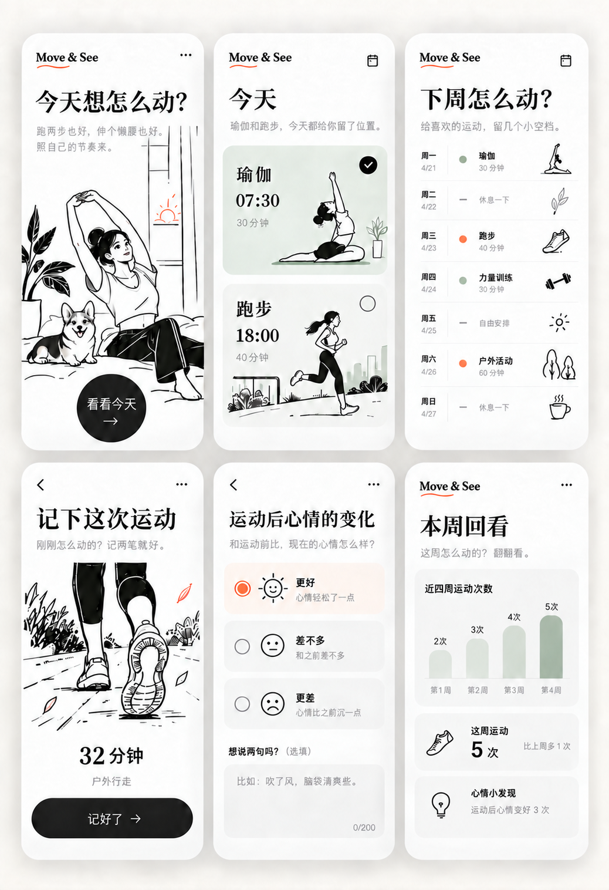

# Move&See｜暂定视觉方向

确认日期：2026-09-25。

用户对本目录参考图的选择：「我觉得这个还不错，暂时先用这个」。后续页面设计以这张图为视觉参考，替代此前探索的奶油手帐、薄荷绿通用卡片和深色运动摄影方案。

## 视觉要点

- 白色或接近白色的底色，充分留白，页面安静、整洁。
- 黑白线稿运动插画，线条有手绘感；场景可体现日常运动与休息。
- 标题采用有衬线感的大字，正文及表单文字使用清晰易读的字体。
- 鼠尾草绿用于少量卡片与图表，橙红色用于少量点缀或选中状态。
- 主要按钮采用黑底白字；卡片圆角柔和，边框和阴影克制。
- 避免手帐贴纸、奶油黄纹理、过多装饰及多色卡片堆叠。

## 应用约定

产品名称与页面品牌统一使用「Move&See」（2026-09-26 用户确认，大小写固定，& 两侧不留空格）。页面、字段及统计口径仍以项目的 `plan.md` 为准；参考图中的六个画面、示例数值与文案不自动改变功能约定。

当前仅保存视觉参考，尚未实现页面。后续按这一方向设计实际界面，参考插画的表达方式并制作适配素材。
